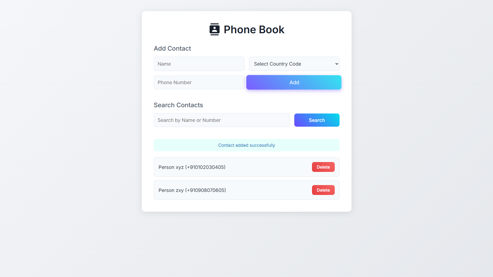
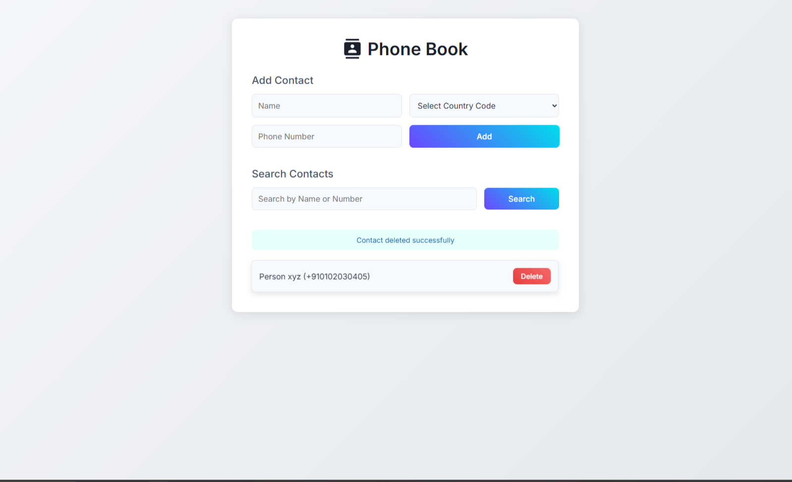
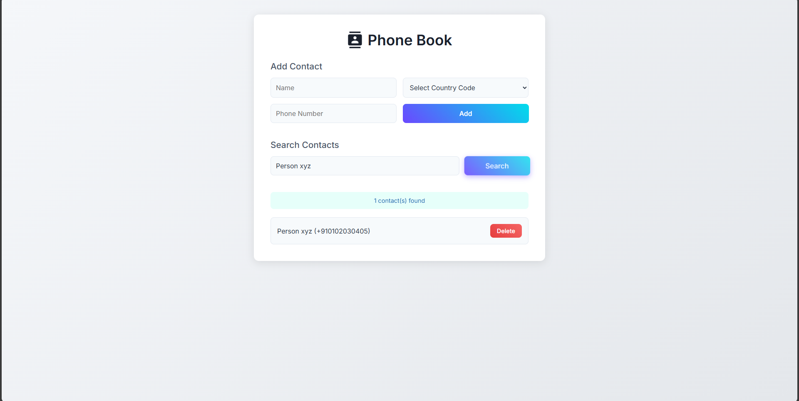

# PhoneBook





**PhoneBook** is a sleek and modern phonebook application designed to manage contacts with ease. Built with HTML, CSS, and JavaScript, it features a minimalist white-themed UI, responsive design, and interactive elements powered by Anime.js. Contacts are stored persistently using localStorage, and the app supports adding, searching, and deleting contacts with a smooth and intuitive user experience.

## Features

- **Add Contacts**: Input name, country code, and phone number to create new contacts with validation for duplicates and numeric phone numbers.
- **Search Contacts**: Search by name or number using a single input field with real-time filtering.
- **Delete Contacts**: Remove individual contacts with a dedicated delete button per contact card.
- **Persistent Storage**: Contacts are saved to localStorage, ensuring data persists across browser sessions.
- **Interactive UI**: 3D tilt effects on buttons, hover animations on contact cards, and smooth Anime.js transitions.
- **Responsive Design**: Fully responsive layout that works seamlessly on desktop and mobile devices.
- **Accessibility**: ARIA labels and keyboard support (Enter key for form submission) for improved accessibility.
- **Modern Aesthetic**: Clean design with the Inter font, gradient buttons, and a light gradient background.

## Demo

Try PhoneBook live: [Insert Live Demo Link Here] (e.g., GitHub Pages, Netlify, or Vercel)

## Installation

Follow these steps to run ContactSphere locally:

1. **Clone the Repository**:
   ```bash
   git clone https://github.com/your-username/contactsphere.git
   cd contactsphere
Open the Application:
Open index.html in a web browser (e.g., Chrome, Firefox).

For a better experience, serve the project using a local server:
bash

npx http-server

Navigate to http://localhost:8080.

Dependencies
ContactSphere uses the following CDN-hosted libraries:
Anime.js: For smooth animations on alerts and contact card transitions.

Inter Font: A modern, clean typeface served via Google Fonts.

No additional installations are required, as these dependencies are loaded directly from CDNs.
Usage
Adding a Contact:
Enter a name, select a country code (e.g., +1 for USA), and input a phone number.

Click the "Add" button or press Enter to save the contact.

The app validates for duplicate numbers and ensures the phone number contains only digits.

Searching Contacts:
Type a name or phone number (partial or full) in the search field.

Click the "Search" button or press Enter to filter the contact list.

Clear the search field and search again to display all contacts.

Deleting a Contact:
Click the red "Delete" button on a contact card to remove it.

The contact list updates instantly, and changes are saved to localStorage.

Exploring the UI:
Hover over buttons to see 3D tilt effects and gradient shifts.

Hover over contact cards for a subtle lift animation.

Test on mobile devices to experience the responsive layout.

Technologies Used
HTML5: Provides the semantic structure for the application.

CSS3: Handles styling, including gradients, flexbox, grid layouts, and media queries for responsiveness.

JavaScript: Manages core functionality, DOM manipulation, and localStorage for data persistence.

Anime.js: Powers animations for alerts (fade and slide) and contact card transitions (fade and slide-in).

Inter Font: Delivers a modern, readable typography via Google Fonts.

Project Structure

contactsphere/
├── index.html        # Main HTML file with structure, styles, and scripts
├── screenshot.png    # Screenshot of the application (add manually)
├── LICENSE           # MIT License file
└── README.md         # Project documentation

Contributing
Contributions are welcome! To contribute:
Fork the repository.

Create a new branch:
bash

git checkout -b feature/your-feature-name

Make your changes and commit:
bash

git commit -m "Add your feature description"

Push to your branch:
bash

git push origin feature/your-feature-name

Open a Pull Request with a clear description of your changes.

Please ensure your code adheres to the existing style and includes relevant documentation or tests.
Issues
Found a bug or have a feature request? Open an issue here with detailed information.
License
This project is licensed under the MIT License. See the LICENSE file for details.
Acknowledgments
Anime.js: For providing smooth and lightweight animations.

Iconify: For the contact icon used in the header.

Inspiration: Modern UI/UX design trends and minimalist web applications.

Contact
For questions or feedback, reach out via GitHub Issues or email at [your-email@example.com (mailto:your-email@example.com)].

