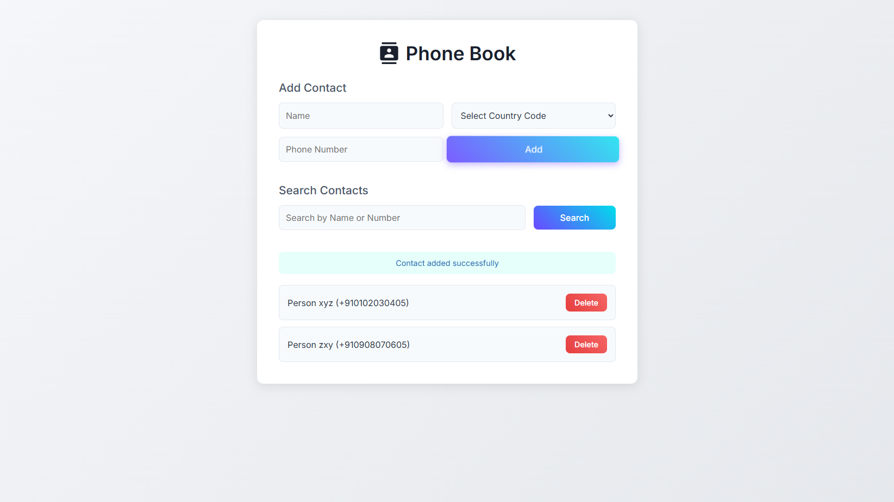
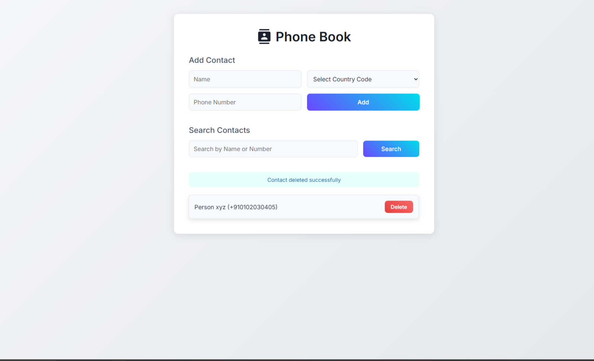
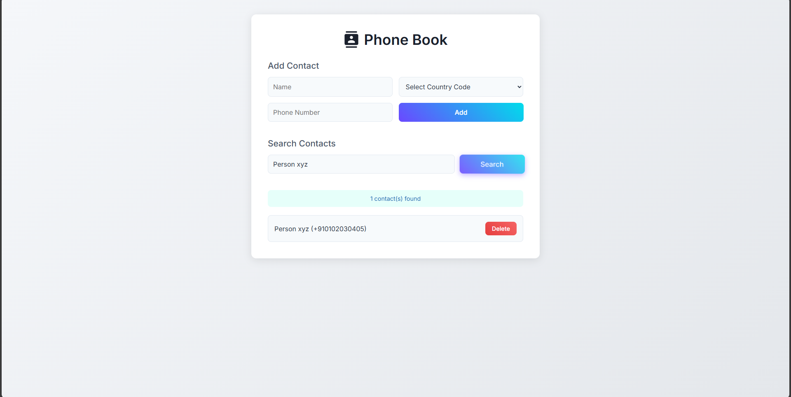

# 📇 PhoneBook

A sleek, lightweight contact manager built with HTML, CSS, JavaScript, and C. Features a clean white UI, 3D button effects, and smooth animations. Add, search, and delete contacts easily—with data stored via localStorage for the web version and file-based storage for the C version.


---

## 📂 Table of Contents

* [Features](#features)
* [Screenshots](#screenshots)
* [Installation](#installation)
* [Usage](#usage)
* [Technologies Used](#technologies-used)
* [Project Structure](#project-structure)
* [Contributing](#contributing)
* [License](#license)
* [Acknowledgments](#acknowledgments)
* [Contact](#contact)

---

## ✨ Features

### Web Version (HTML/CSS/JS)

* **Add Contacts**: Input name, country code, and phone number with validation to prevent duplicates and ensure numeric entries.
* **Search Contacts**: Filter contacts by name or phone number using a responsive search bar.
* **Delete Contacts**: Remove unwanted contacts with a dedicated delete button on each contact card.
* **Persistent Storage**: Utilizes `localStorage` to save contacts across browser sessions.
* **Interactive UI**:

  * 3D tilt effects on buttons for an engaging hover experience.
  * Smooth animations powered by Anime.js.
* **Responsive Design**: Adapts seamlessly to desktop and mobile devices.
* **Accessibility**: Includes ARIA labels and keyboard support (e.g., Enter key for form submission).

### C Version (Command-Line Interface)

* **Add Contacts**: Prompt-based input for name, country code, and phone number.
* **Search Contacts**: Search functionality to find contacts by name or number.
* **Delete Contacts**: Option to delete contacts by specifying the contact's name or number.
* **File-Based Storage**: Contacts are stored in a text file (`contacts.txt`) for persistence.
* **Menu-Driven Interface**: User-friendly menu to navigate through different operations.

---

## 📸 Screenshots


*Main interface of PhoneBook with contact cards and gradient buttons.*


*Adding a new contact with name, country code, and phone number.*


*Searching and filtering contacts by name or number.*([GitHub Docs][1])

---

## 🛠️ Installation

### Web Version

1. **Clone the Repository**:

   ```bash
   git clone https://github.com/Sourodyuti/PhoneBook.git
   cd PhoneBook
   ```


2. **Open the Application**:

   * Open `index.html` in your preferred web browser (e.g., Chrome, Firefox).
   * For an enhanced experience, serve the project using a local server:

     ```bash
     npx http-server
     ```

     Then navigate to `http://localhost:8080` in your browser.

   *Note: Ensure you have an internet connection to load external resources like fonts and scripts.*

### C Version

1. **Compile the Program**:

   ```bash
   gcc Phonebook.c -o phonebook
   ```


2. **Run the Application**:

   ```bash
   ./phonebook
   ```


*Note: Ensure you have GCC installed on your system.*

---

## 🚀 Usage

### Web Version

* **Adding a Contact**:

  1. Enter the contact's name.
  2. Select the country code from the dropdown (e.g., +1 for USA).
  3. Input the phone number (must contain only digits).
  4. Click the "Add" button or press Enter.

* **Searching for Contacts**:

  1. Type a name or phone number (partial or full) in the search field.
  2. Click the "Search" button or press Enter to filter the contact list.
  3. Clear the search field to display all contacts.

* **Deleting a Contact**:

  1. Locate the contact you wish to delete.
  2. Click the red "Delete" button on the contact card.

### C Version

* **Menu Options**:

  * Add Contact
  * Search Contact
  * Delete Contact
  * View All Contacts
  * Exit([GitHub Docs][1], [Server Fault][2], [SpringerLink][3])

* **Operations**:

  * Follow the on-screen prompts to perform desired operations.
  * Contacts are saved in `contacts.txt` in the same directory.

---

## 🧰 Technologies Used

* **Frontend**:

  * HTML5
  * CSS3
  * JavaScript
  * Anime.js (for animations)
  * Google Fonts (Inter)([happygitwithr.com][4])

* **Backend**:

  * C Programming Language
  * File Handling for Data Persistence

---

## 📁 Project Structure

```plaintext
PhoneBook/
├── index.html        # Main HTML file with structure, styles, and scripts
├── Phonebook.c       # C source code for CLI version
├── contacts.txt      # Data file for storing contacts in CLI version
├── Pictures/
│   ├── Screenshot_1.png  # Screenshot of the main interface
│   ├── Screenshot_2.png  # Screenshot of adding a contact
│   └── Screenshot_3.png  # Screenshot of searching contacts
├── LICENSE           # MIT License file
└── README.md         # This documentation file
```


---

## 🤝 Contributing

Contributions are welcome! To contribute:

1. **Fork the Repository**:

   ```bash
   git clone https://github.com/your-username/PhoneBook.git
   ```


2. **Create a New Branch**:

   ```bash
   git checkout -b feature/your-feature-name
   ```


3. **Make Your Changes and Commit**:

   ```bash
   git commit -m "Add your feature description"
   ```


4. **Push to Your Branch**:

   ```bash
   git push origin feature/your-feature-name
   ```


5. **Open a Pull Request**:

   * Provide a clear description of your changes.

*Please ensure your code adheres to the project's style and includes relevant documentation or tests.*

---

## 📄 License

This project is licensed under the MIT License. See the [LICENSE](LICENSE) file for full details.

---

## 🙏 Acknowledgments

* [Anime.js](https://animejs.com/) for lightweight and smooth animations.
* [Google Fonts](https://fonts.google.com/) for the Inter font.
* Inspired by modern UI/UX trends and minimalist web applications.

---

## 📬 Contact

For questions or feedback, reach out via:

* GitHub Issues: [Sourodyuti/PhoneBook](https://github.com/Sourodyuti/PhoneBook/issues)
* Twitter: [@SourodyutiBS](https://twitter.com/SourodyutiBS)

---

*Happy contact managing with PhoneBook! 📇*

---

\
